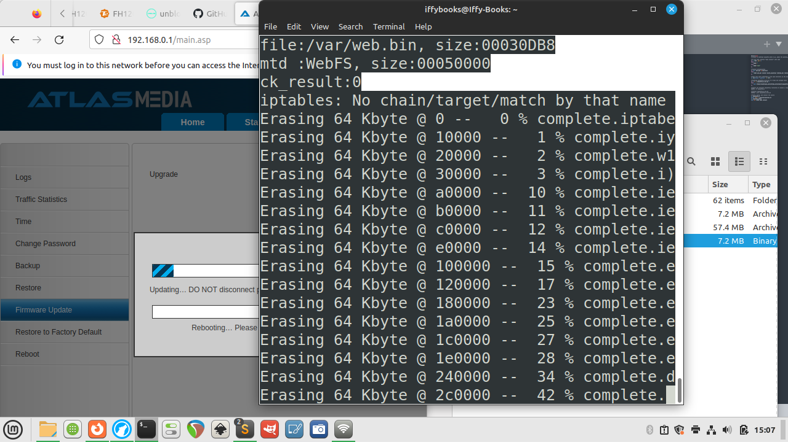

# Notes for Router Hack Day 2


## Access your router's serial shell

Disassemble your router. You'll need to remove a screw on the bottom,
which is covered by a sticker.

Cut the ends off three DuPont jumper wires, leaving port connectors on
the other ends.

Solder the stripped wires to the terminal points pictured below,
located in the middle of the circuit board.

Connect the terminal labeled **Tx** in the image above to the pin
labeled [Rx]{.c8} on your USB serial interface. Next, connect
[Rx]{.c8} from the router to [Tx]{.c8} on the USB serial interface. Then
connect **GND** to **GND**


 ❏ Plug the USB serial interface into your computer.

❏ Plug in the router.

❏ Run the following command to see if your USB serial interface is
connected:

```
ls /dev/ttyUSB*
```

The output should be something like `/dev/ttyUSB0`. If you don't get any output, you can try running the following command to uninstall **brltty** (a program for interfacing with braille displays).

```
sudo apt-get autoremove brltty
```

If you're still troubleshooting, you can run the following two commands to get more info about your connected USB devices:

```
lsusb
dmesg
```

## Open a serial connection with your router

Run the following command to install minicom:

```
sudo apt-get install minicom
```

Command for opening serial connection with your router:

```
minicom -D /dev/ttyUSB0 -c on
```

Press CTRL+A, then press O to open the configuration menu. Use the arrow
keys to select **Serial port setup**.{style="width: 664.80px; height: 373.93px; margin-left: 0.00px; margin-top: 0.00px; transform: rotate(0.00rad) translateZ(0px); -webkit-transform: rotate(0.00rad) translateZ(0px);"}]{style="overflow: hidden; display: inline-block; margin: 0.00px 0.00px; border: 0.00px solid #000000; transform: rotate(0.00rad) translateZ(0px); -webkit-transform: rotate(0.00rad) translateZ(0px); width: 664.80px; height: 373.93px;"}

Press [F]{.c8} to switch [Hardware Flow Control]{.c8} to
*No*.

Before:

{style="width: 452.51px; height: 310.30px; margin-left: -28.28px; margin-top: -46.40px; transform: rotate(0.00rad) translateZ(0px); -webkit-transform: rotate(0.00rad) translateZ(0px);"}

After:

{style="width: 455.03px; height: 310.37px; margin-left: -28.08px; margin-top: -46.35px; transform: rotate(0.00rad) translateZ(0px); -webkit-transform: rotate(0.00rad) translateZ(0px);"}

Press **enter** to close the serial port setup menu.

To save this setting as your default, use the down arrow to select [Save
setup as dfl]{.c8}[. Press enter to save.

{style="width: 448.34px; height: 281.45px; margin-left: -16.39px; margin-top: -5.01px; transform: rotate(0.00rad) translateZ(0px); -webkit-transform: rotate(0.00rad) translateZ(0px);"}]{style="overflow: hidden; display: inline-block; margin: 0.00px 0.00px; border: 0.00px solid #000000; transform: rotate(0.00rad) translateZ(0px); -webkit-transform: rotate(0.00rad) translateZ(0px); width: 326.07px; height: 263.00px;"}

Use the arrow keys to select [Exit]{.c8}, then press
[enter]{.c8}[.

Press enter and you'll be prompted to log in.

username: root

password: Fireitup

Press [tab]{.c8}[ twice in a row to see a list of available
software.

Restart your router while the USB serial connector is attached and
you'll see a waterfall of interesting startup info:

{style="width: 495.66px; height: 276.25px; margin-left: -3.98px; margin-top: -5.75px; transform: rotate(0.00rad) translateZ(0px); -webkit-transform: rotate(0.00rad) translateZ(0px);"}]{style="overflow: hidden; display: inline-block; margin: 0.00px 0.00px; border: 0.00px solid #000000; transform: rotate(0.00rad) translateZ(0px); -webkit-transform: rotate(0.00rad) translateZ(0px); width: 476.20px; height: 258.73px;"}

To get your router's SSID name, use the command [wl status]{.c8}[.

{style="width: 427.80px; height: 238.48px; margin-left: -2.96px; margin-top: -4.28px; transform: rotate(0.00rad) translateZ(0px); -webkit-transform: rotate(0.00rad) translateZ(0px);"}]{style="overflow: hidden; display: inline-block; margin: 0.00px 0.00px; border: 0.00px solid #000000; transform: rotate(0.00rad) translateZ(0px); -webkit-transform: rotate(0.00rad) translateZ(0px); width: 410.80px; height: 223.40px;"}

[Creating 8 MTD partitions on \"sflash\":

\[what\'s on the flash device\]

binwalk -Me \.....bin

CRC value tells us the checksum of everything after HDR0

OpenWRT has tools to do this.

dd for manipulating the firmware

40 hex bytes at a time, but skip first 40 bytes:

dd if=US_FH1201V1.0BR_V1.2.0.14\\(408\\)\_EN_RD.bin of=data
bs=\$((0x40)) skip=1

In CFE mode, give yourself an IP address

Like 192.168.1.X

Then go to 192.168.1.1 and upload TRX firmware file

Remove

TRX format starts with HR0 in all caps

trx format

\#########

Mount file system in serial shell:

mount -t usbfs none /proc/bus/usb/

Show connected USB devices:

cat /proc/bus/usb/

Do a web search for vendor id number and prodID number to get the chip
details

Wireless adapter:

BCM43526

\[SOIC8

square next to serial connectors, which contains the firmware

\]

SOIC:

25q64b

\[CH341 is the tool to flash the firmware chip itself\]

Main CPU:

BCM5357

32-bit little endian

go to buildroot dir

make menuconfig

target options \-- MIPS little endian

toolchain \--\> change c compiler to musl

build options \--\> switch libraries to static only

target packages -\> networking applications -\> enable tcpdump (press
space)

save and exit

make tcpdump

## Download router firmware

[Here's the stock firmware that comes with the router:

Atlas Media AMW-DBR1200AC Firmware:]{.c6}

[             
]{.c7}[[https://iffybooks.net/wp-content/uploads/2023/05/AtlasMedia_AC1200_FirmwareV1.4.bin](https://www.google.com/url?q=https://iffybooks.net/wp-content/uploads/2023/05/AtlasMedia_AC1200_FirmwareV1.4.bin&sa=D&source=editors&ust=1687491815732647&usg=AOvVaw35NOxv89RdpF5V6RBdIUHF){.c12}]{.c4}

[And here are two firmware releases from Tenda that work with the
router. You'll need to extract the files after downloading.

Tenda FH1201 Firmware V1.2.0.8_EN:]{.c13 .c16 .c8}[ \

 ]{.c7}[[h](https://www.google.com/url?q=https://www.tendacn.com/us/download/detail-2123.html&sa=D&source=editors&ust=1687491815733143&usg=AOvVaw3FdE1pvtPm-j5gr5-SM4cH){.c12}]{.c1
.c8
.c16}[[ttps://www.tendacn.com/us/download/detail-2123.html](https://www.google.com/url?q=https://www.tendacn.com/us/download/detail-2123.html&sa=D&source=editors&ust=1687491815733321&usg=AOvVaw2ALaB24KgMalevRccKuXjJ){.c12}]{.c4}

[Tenda FH1206 Firmware V1.2.0.8(8155)\_EN:]{.c6}

[             
]{.c7}[[https://www.tendacn.com/us/download/detail-2344.html](https://www.google.com/url?q=https://www.tendacn.com/us/download/detail-2344.html&sa=D&source=editors&ust=1687491815733587&usg=AOvVaw1MbjtlTtHl8R5TLIhDThV1){.c12}]{.c4}

Download the [[Tenda
FH1206](https://www.google.com/url?q=https://www.tendacn.com/us/download/detail-2344.html&sa=D&source=editors&ust=1687491815733826&usg=AOvVaw3GSgpqA29tuHjrpWse8HSo){.c12}]{.c1}[ firmware,
or your firmware of choice from the list above.

Decompress the
[[RAR](https://www.google.com/url?q=https://en.wikipedia.org/wiki/RAR_(file_format)&sa=D&source=editors&ust=1687491815734065&usg=AOvVaw14-VebMCdiThVr9G98d92O){.c12}]{.c1} files
you downloaded from Tenda's site, giving you a firmware file with a name
like [US_FH1206V1.0BR_V1.2.0.8(8155)\_EN_TD.bin]{.c8}[. If you don't
already have a program installed for decompressing RAR files, you can
use one of the following:

        ]{.c17 .c8}[MacOS:]{.c13 .c8} [The Unarchiver]{.c18

.c23} [[https://theunarchiver.com](https://www.google.com/url?q=https://theunarchiver.com/&sa=D&source=editors&ust=1687491815734442&usg=AOvVaw0ZRgVfVXTzXhjTE8J7HuR5){.c12}]{.c1}

[        ]{.c17 .c8}[Windows:]{.c13 .c8} WinRAR
[[https://www.win-rar.com](https://www.google.com/url?q=https://www.win-rar.com/&sa=D&source=editors&ust=1687491815734764&usg=AOvVaw3s5jRtvU_JSLzsYkPRWYaf){.c12}]{.c1}

[        ]{.c8 .c17}[Linux:]{.c8 .c13} unrar
[[https://linux.die.net/man/1/unrar](https://www.google.com/url?q=https://linux.die.net/man/1/unrar&sa=D&source=editors&ust=1687491815735080&usg=AOvVaw3mjD2T5OHci2OIcO2uNDK1){.c12}]{.c1}

[Upload new firmware through the router admin panel]{.c8 .c9}

[ 

{style="width: 664.80px; height: 373.93px; margin-left: 0.00px; margin-top: 0.00px; transform: rotate(0.00rad) translateZ(0px); -webkit-transform: rotate(0.00rad) translateZ(0px);"}]{style="overflow: hidden; display: inline-block; margin: 0.00px 0.00px; border: 0.00px solid #000000; transform: rotate(0.00rad) translateZ(0px); -webkit-transform: rotate(0.00rad) translateZ(0px); width: 664.80px; height: 373.93px;"}

[{style="width: 664.80px; height: 373.93px; margin-left: 0.00px; margin-top: 0.00px; transform: rotate(0.00rad) translateZ(0px); -webkit-transform: rotate(0.00rad) translateZ(0px);"}]{style="overflow: hidden; display: inline-block; margin: 0.00px 0.00px; border: 0.00px solid #000000; transform: rotate(0.00rad) translateZ(0px); -webkit-transform: rotate(0.00rad) translateZ(0px); width: 664.80px; height: 373.93px;"}

[{style="width: 664.80px; height: 373.93px; margin-left: 0.00px; margin-top: 0.00px; transform: rotate(0.00rad) translateZ(0px); -webkit-transform: rotate(0.00rad) translateZ(0px);"}]{style="overflow: hidden; display: inline-block; margin: 0.00px 0.00px; border: 0.00px solid #000000; transform: rotate(0.00rad) translateZ(0px); -webkit-transform: rotate(0.00rad) translateZ(0px); width: 664.80px; height: 373.93px;"}

[{style="width: 664.80px; height: 373.93px; margin-left: 0.00px; margin-top: 0.00px; transform: rotate(0.00rad) translateZ(0px); -webkit-transform: rotate(0.00rad) translateZ(0px);"}]{style="overflow: hidden; display: inline-block; margin: 0.00px 0.00px; border: 0.00px solid #000000; transform: rotate(0.00rad) translateZ(0px); -webkit-transform: rotate(0.00rad) translateZ(0px); width: 664.80px; height: 373.93px;"}

## Decompress the router firmware

[These instructions are from Jim. Thanks, Jim!

clone the repo
git clone https://github.com/devttys0/sasquatch.git

then cd in to sasquatch directory

the README mentions this as a pre-req, so do this
sudo apt-get install build-essential liblzma-dev liblzo2-dev zlib1g-dev

if you run ./build.sh at this point you will get a bunch of errors related to xz_wrapper and LZMA
eventually it ends in something like this:

xz_wrapper.c:462:20: error: ‘LZMA_BUF_ERROR’ undeclared (first use in this function)
  462 |   } else if(res != LZMA_BUF_ERROR)
      |                    ^~~~~~~~~~~~~~
xz_wrapper.c: In function ‘xz_uncompress’:
xz_wrapper.c:494:2: error: unknown type name ‘lzma_ret’
  494 |  lzma_ret res = lzma_stream_buffer_decode(&memlimit, 0, NULL,
      |  ^~~~~~~~
xz_wrapper.c:494:17: error: implicit declaration of function ‘lzma_stream_buffer_decode’ [-Werror=implicit-function-declaration]
  494 |  lzma_ret res = lzma_stream_buffer_decode(&memlimit, 0, NULL,
      |                 ^~~~~~~~~~~~~~~~~~~~~~~~~
xz_wrapper.c:497:12: error: ‘LZMA_OK’ undeclared (first use in this function)
  497 |  if(res == LZMA_OK && size == (int) src_pos)
      |            ^~~~~~~
xz_wrapper.c:503:1: error: control reaches end of non-void function [-Werror=return-type]
  503 | }
      | ^
cc1: all warnings being treated as errors
make: *** [<builtin>: xz_wrapper.o] Error 1

open the patch file in ./patches/patch0.txt and find this section

# To build using XZ Utils liblzma - install the library and uncomment

# the XZ_SUPPORT line below.

# 

-#XZ_SUPPORT = 1
+XZ_SUPPORT = 1

It will be around line 38087 of the 38726, so pretty close to the bottom of the file

change the line from
+XZ_SUPPORT = 1
to
+XZ_SUPPORT = 0

then run ./build.sh again

this time it works successfully and end in something like this

make[1]: Entering directory '/AC1200/sasquatch/squashfs4.3/squashfs-tools/LZMA/lzmadaptive/C/7zip/Compress/LZMA_Lib'
make[1]: Nothing to be done for 'all'.
make[1]: Leaving directory '/AC1200/sasquatch/squashfs4.3/squashfs-tools/LZMA/lzmadaptive/C/7zip/Compress/LZMA_Lib'
cc -g -O2  -I. -I./LZMA/lzma465/C -I./LZMA/lzmalt -I./LZMA/lzmadaptive/C/7zip/Compress/LZMA_Lib -D_FILE_OFFSET_BITS=64 -D_LARGEFILE_SOURCE -D_GNU_SOURCE -DCOMP_DEFAULT=\"gzip\" -Wall -Werror  -DGZIP_SUPPORT -DLZMA_SUPPORT -DLZO_SUPPORT -DXATTR_SUPPORT -DXATTR_DEFAULT   -c -o lzma_wrapper.o lzma_wrapper.c
g++   ./LZMA/lzmalt/*.o unsquashfs.o unsquash-1.o unsquash-2.o unsquash-3.o unsquash-4.o swap.o compressor.o unsquashfs_info.o gzip_wrapper.o lzma_wrapper.o ./LZMA/lzma465/C/Alloc.o ./LZMA/lzma465/C/LzFind.o ./LZMA/lzma465/C/LzmaDec.o ./LZMA/lzma465/C/LzmaEnc.o ./LZMA/lzma465/C/LzmaLib.o lzo_wrapper.o read_xattrs.o unsquashfs_xattr.o -lpthread -lm -lz -L./LZMA/lzmadaptive/C/7zip/Compress/LZMA_Lib -llzmalib   -llzo2 -o sasquatch
mkdir -p /usr/local/bin
cp sasquatch /usr/local/bin

now when you run binwalk on the firmware dump file it will extract as expected

binwalk -eM flash.bin

now the squashfs-root directory contains the files from the router

notably, check out the passwd and shadow files

$ find . | egrep "passwd|shadow"
./squashfs-root/etc_ro/passwd
./squashfs-root/etc_ro/passwd_private
./squashfs-root/etc_ro/shadow
./squashfs-root/etc_ro/shadow_private
./squashfs-root/usr/bin/passwd
./squashfs-root/usr/sbin/chpasswd
./squashfs-root/var/etc/passwd
./squashfs-root/var/etc/passwd_private
./squashfs-root/var/etc/shadow
./squashfs-root/var/etc/shadow_private

## Install and configure buildroot

Go to [buildroot.org]{.c8} and click [Download]{.c8}[. Download and
extract the package.

cd]{.c8} to the directory you just created. Then run the command [make
menuconfig]{.c8}[.

{style="width: 567.90px; height: 245.71px; margin-left: -86.13px; margin-top: -10.45px; transform: rotate(0.00rad) translateZ(0px); -webkit-transform: rotate(0.00rad) translateZ(0px);"}]{style="overflow: hidden; display: inline-block; margin: 0.00px 0.00px; border: 0.00px solid #000000; transform: rotate(0.00rad) translateZ(0px); -webkit-transform: rotate(0.00rad) translateZ(0px); width: 395.27px; height: 121.20px;"}

Go to **Target options \> Target Architecture** and select
**MIPS (little endian)**.

Go to [Toolchain \>]{.c8} [Toolchain type]{.c8}[ and switch the C
library to ]{.c18}[musl]{.c8}[.]{.c18}

[{style="width: 664.80px; height: 373.73px; margin-left: 0.00px; margin-top: 0.00px; transform: rotate(0.00rad) translateZ(0px); -webkit-transform: rotate(0.00rad) translateZ(0px);"}]{style="overflow: hidden; display: inline-block; margin: 0.00px 0.00px; border: 0.00px solid #000000; transform: rotate(0.00rad) translateZ(0px); -webkit-transform: rotate(0.00rad) translateZ(0px); width: 664.80px; height: 373.73px;"}

[{style="width: 664.80px; height: 373.73px; margin-left: 0.00px; margin-top: 0.00px; transform: rotate(0.00rad) translateZ(0px); -webkit-transform: rotate(0.00rad) translateZ(0px);"}]{style="overflow: hidden; display: inline-block; margin: 0.00px 0.00px; border: 0.00px solid #000000; transform: rotate(0.00rad) translateZ(0px); -webkit-transform: rotate(0.00rad) translateZ(0px); width: 664.80px; height: 373.73px;"}

Select [Exit]{.c8}[ to go back to the main menu.]{.c18}

Go to [Build options ]{.c8}and set [libraries]{.c8} to [shared
only]{.c8}[.

{style="width: 664.80px; height: 373.73px; margin-left: 0.00px; margin-top: 0.00px; transform: rotate(0.00rad) translateZ(0px); -webkit-transform: rotate(0.00rad) translateZ(0px);"}]{style="overflow: hidden; display: inline-block; margin: 0.00px 0.00px; border: 0.00px solid #000000; transform: rotate(0.00rad) translateZ(0px); -webkit-transform: rotate(0.00rad) translateZ(0px); width: 664.80px; height: 373.73px;"}

Go back to the main menu and use the left and right arrow keys to select
[Save]{.c8}. Select [OK]{.c8} and press [enter]{.c8}[.

{style="width: 625.19px; height: 354.83px; margin-left: -0.00px; margin-top: -0.00px; transform: rotate(0.00rad) translateZ(0px); -webkit-transform: rotate(0.00rad) translateZ(0px);"}]{style="overflow: hidden; display: inline-block; margin: 0.00px 0.00px; border: 0.00px solid #000000; transform: rotate(0.00rad) translateZ(0px); -webkit-transform: rotate(0.00rad) translateZ(0px); width: 530.40px; height: 308.07px;"}

[{style="width: 470.39px; height: 287.26px; margin-left: -70.62px; margin-top: -12.92px; transform: rotate(0.00rad) translateZ(0px); -webkit-transform: rotate(0.00rad) translateZ(0px);"}]{style="overflow: hidden; display: inline-block; margin: 0.00px 0.00px; border: 0.00px solid #000000; transform: rotate(0.00rad) translateZ(0px); -webkit-transform: rotate(0.00rad) translateZ(0px); width: 327.73px; height: 236.67px;"}

Select [Exit]{.c8}[ to close the menuconfig tool.

Next, run the command [make tcpdump]{.c8}[. It will take a while,
possibly 20 minutes or more.

{style="width: 568.64px; height: 346.83px; margin-left: -84.93px; margin-top: -15.65px; transform: rotate(0.00rad) translateZ(0px); -webkit-transform: rotate(0.00rad) translateZ(0px);"}]{style="overflow: hidden; display: inline-block; margin: 0.00px 0.00px; border: 0.00px solid #000000; transform: rotate(0.00rad) translateZ(0px); -webkit-transform: rotate(0.00rad) translateZ(0px); width: 396.60px; height: 285.33px;"}

[
