# Install OpenWrt on your Atlas Media Router

The Iffy Books router challenge is complete! We have a working build of OpenWrt that you can install on the Atlas Media routers we've been hacking away at for the past few months! Retry and Jim are sharing the prize, which we'll award at [Router Hack Day III](https://iffybooks.net/event/router-hack-day-3/) on Saturday, July 29th. We should also thank Anthony, who helped with initial research and did a great job spreading the word about the project.

This post will show you how to install Retry's build of OpenWrt on your Atlas Media AC1200 router (actually a rebranded Tenda FH1205 router). This project doesn't require any soldering, but you will need to disassemble the router's case and connect a couple wires to the board.

If you're interested in soldering wires to the router's serial pinout to access the serial shell, check out our blog post [Notes for Router Hack Day II](https://iffybooks.net/router-hack-day-2/). That post will also get you started on decompressing the router's stock firmware.

For background info and instructions on gaining telnet access using the router's stock firmware, check out Jim's [Challenge Router Progress Report](https://iffybooks.net/challenge-router-progress/). For hardware specs and manuals, check out [the event page for Router Hack Day I](https://iffybooks.net/event/router-hack-day/).

## Getting started

❏ Download the OpenWrt firmware from the following URL:
https://iffybooks.net/AtlasMediaOpenWrt.trx

❏ Turn off your wi-fi.

❏ Connect the router to your computer with an ethernet cable and power it on.

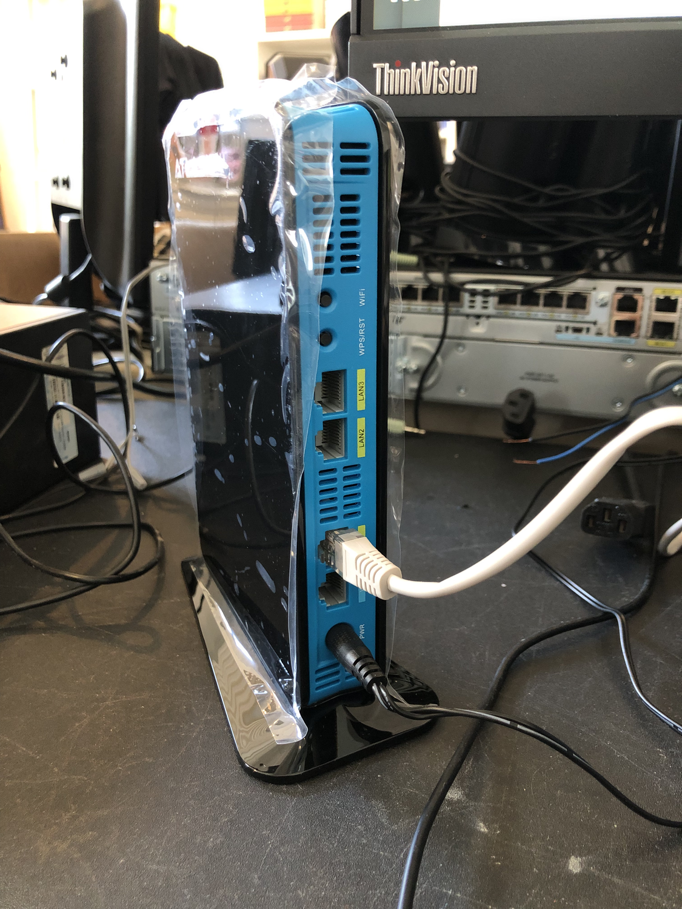

❏ Give yourself a static IP address.

Ubuntu: 

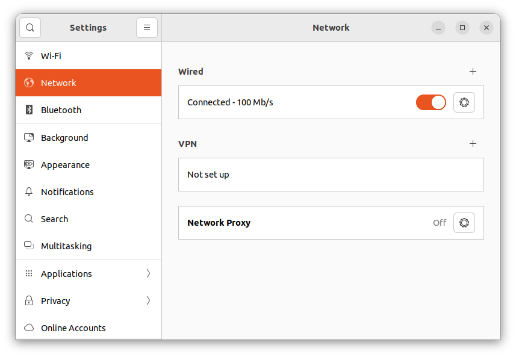

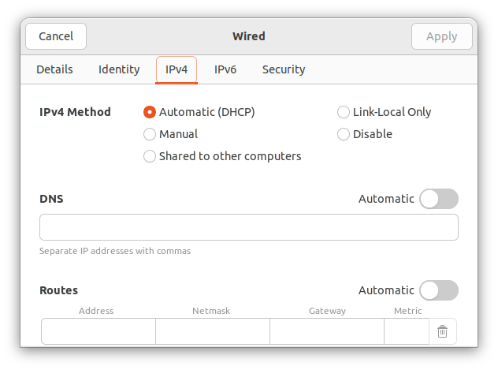

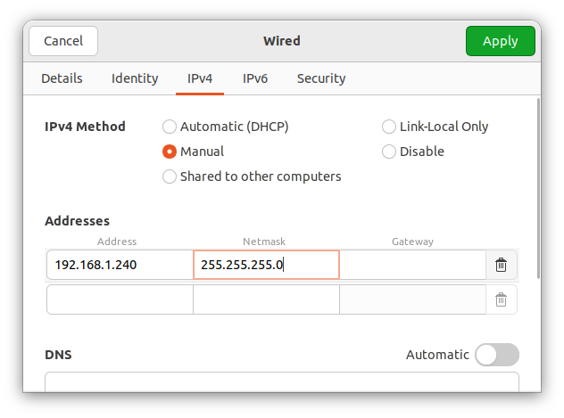

macOS: 
Windows: 

❏ Connect the port end of your alligator clip to the GND pin on your USB serial interface.

❏ Attach the port end of a port-to-plug jumper wire to the USB serial interface’s Tx pin.

❏ Disconnect the power cable and Ethernet from the router.

❏ Find the screw on the bottom of the router and unscrew it. Remove the base.

❏ With the thicker side of the router facing left, pry off the front panel of the case. It's easiest to start at the corner on the narrow end.

Here's what the router looks like inside:

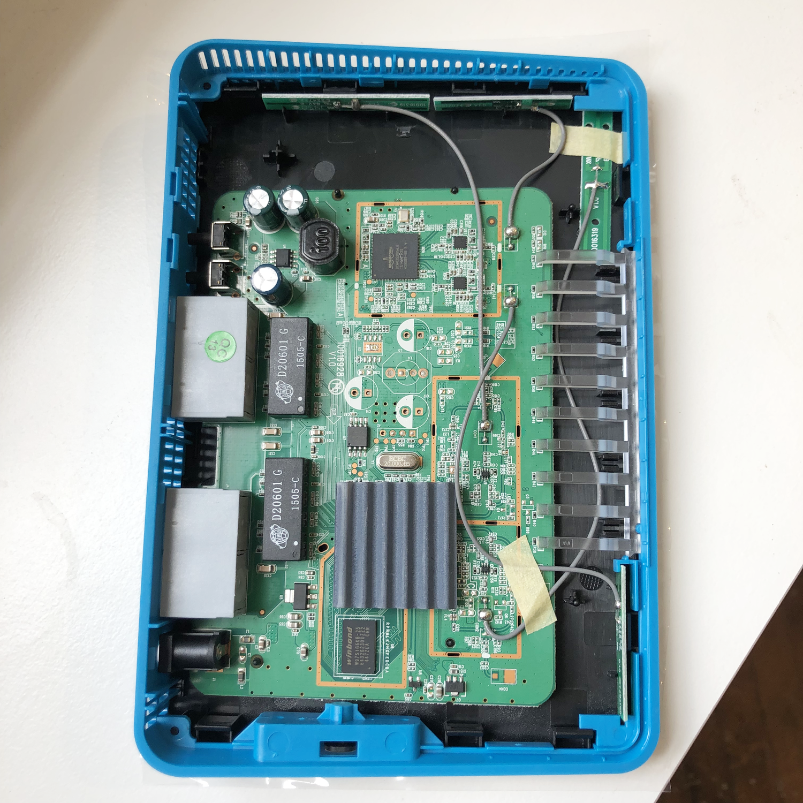

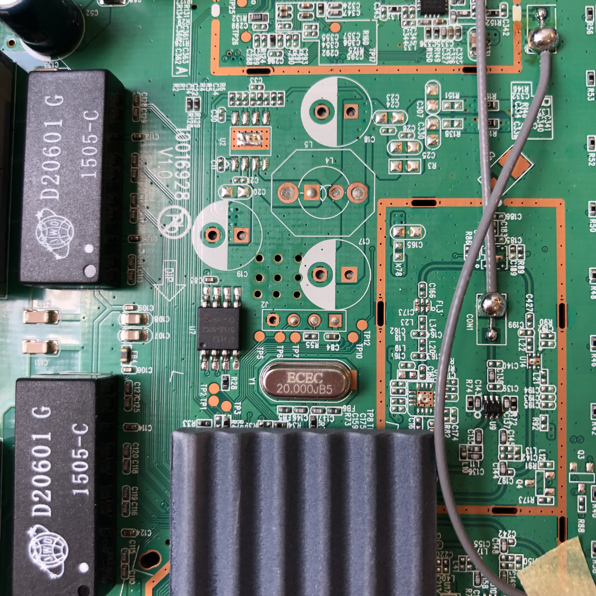

❏ Run the following command to install minicom:

sudo apt-get install minicom

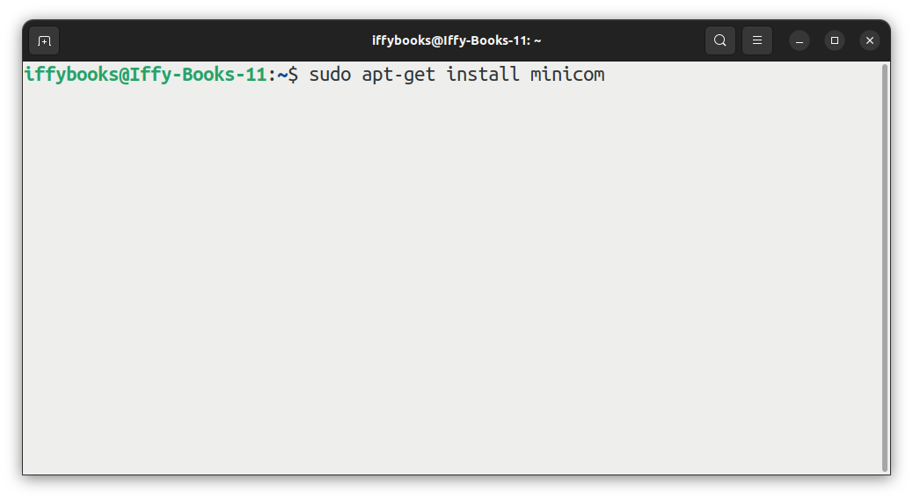

❏ Attach your USB serial interface to your computer.

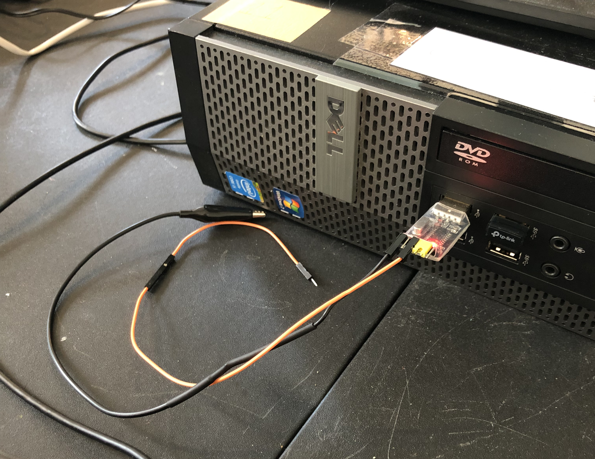

❏ Open a terminal window and run the following command:

minicom -D /dev/ttyUSB0 -c on

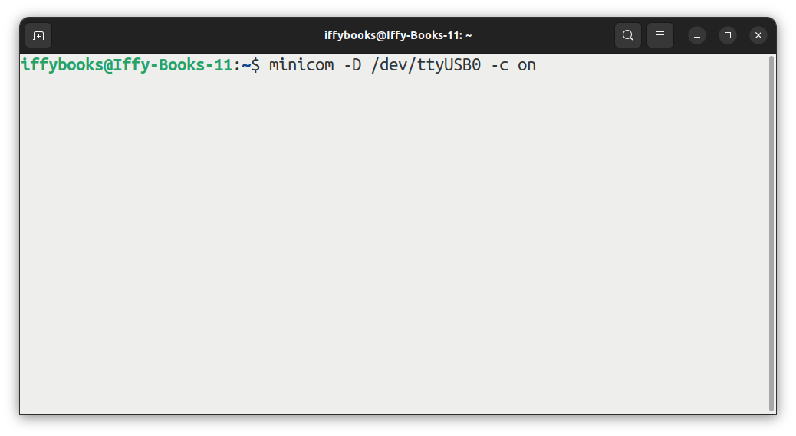

❏ Next you'll test your USB serial adapter. Touch the plug end of your Tx jumper wire to the Rx pin, then type a few characters in the minicom window. If the characters appear onscreen, your USB serial interface is working.

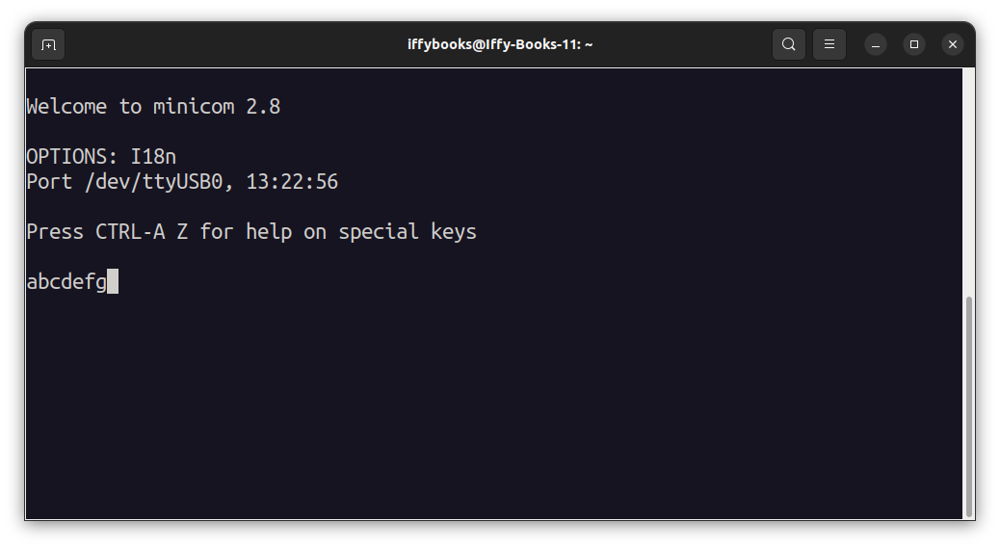

❏ Reconnect the ethernet cable to your router.

❏ Attach the alligator clip from your USB serial interface to the exposed metal on one (or both) of the router's external buttons.

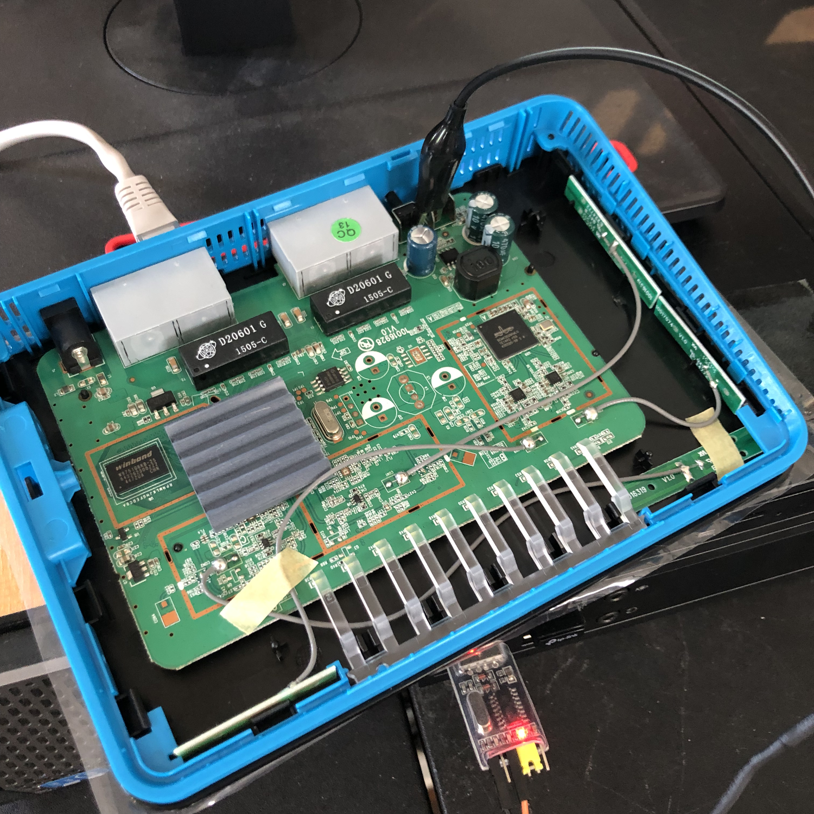

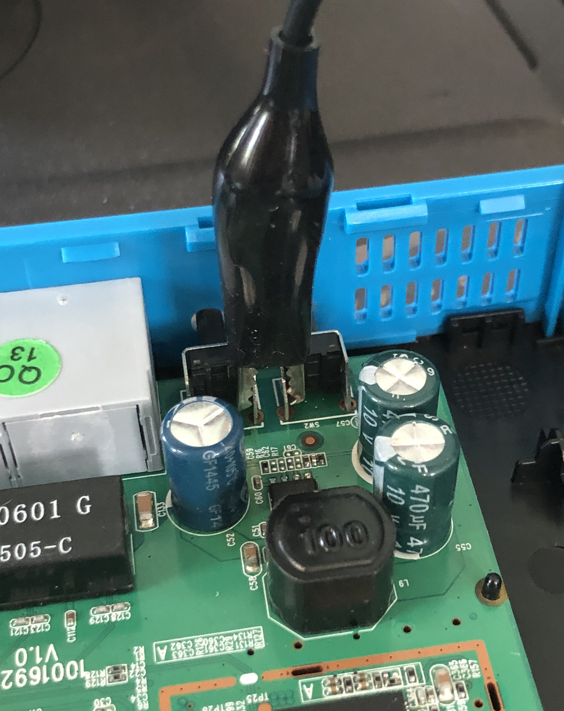

❏ Touch the plug end your Tx jumper wire to the Rx pin indicated in the photo below. Hold it there firmly for the next step.

❏ Make sure your minicom terminal window is open. Plug in your router and immediately press ctrl+C on your keyboard repeatedly.

❏ Open your browser and go to the following address: http://192.168.1.1

If you're in CFE mode, you'll see a page like the one below. If not, skip back to the previous step and try again.

❏ Click **Browse ...** and select the firmware file, **AtlasMediaOpenWrt.trx**.

❏ Click **Upload** to start uploading the file.

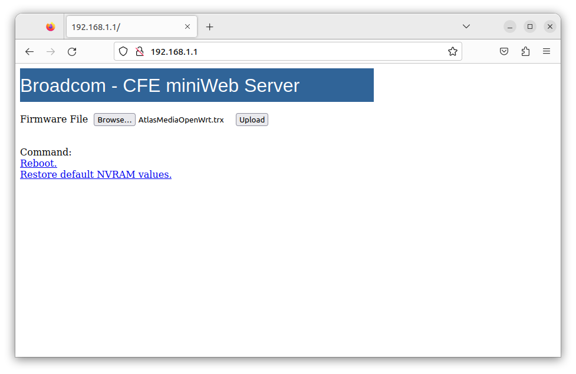

❏ When you see the page below, it means your firmware has been uploaded successfully.

❏ Wait a minute or two for OpenWrt to finish setting up, then go the following address in your browser:
http://192.168.1.1

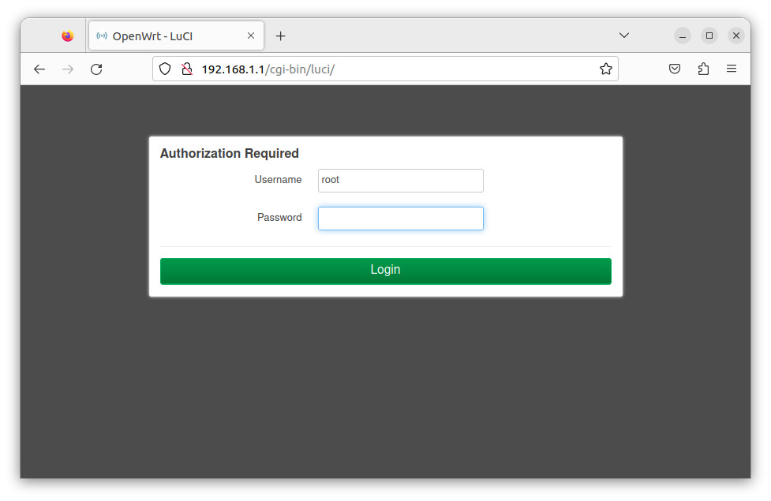

❏ There's isn't a password set by default. Press enter to log in.

❏ Set a new password.

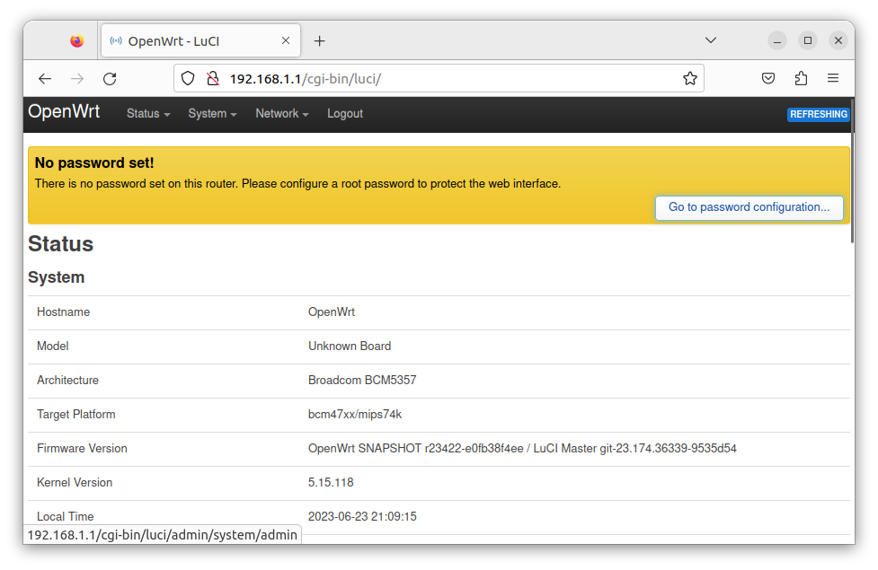

❏ Change your router's local IP address to avoid conflicts.
[...]

❏ Before reassembling your router's case, you may want to drill holes in it to provide access to the ground and Rx pins in case you want to re-flash the firmware later.

❏ Remove the alligator clip from the router.

❏ Snap the case back together. (You may want to disconnect power while you do this.)

❏ Screw on the router's base.

###########

- Give Your Router a Unique IP address on the LAN:

https://openwrt.org/docs/guide-user/network/openwrt_as_routerdevice

Change the IP address to 192.168.1.X, where X is a number <= 255, but not 1.

- Connect an ethernet cable from the internet to your router

- Check your internet connection

ssh root@192.168.1.10

- Update the package manager

opkg update

- Open the OpenWrt admin panel and go to System > Software 
